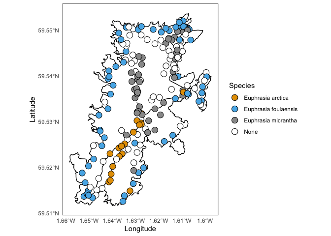

Distribution map of some species of Eyebright on Fair Isle
================
Max R Brown
16 April, 2020

These maps were created using Open Street Maps, a project that
distributes free geographic data for the world.

This is an example map created using the package osmdata, passed to
ggplot2:

<!-- -->
